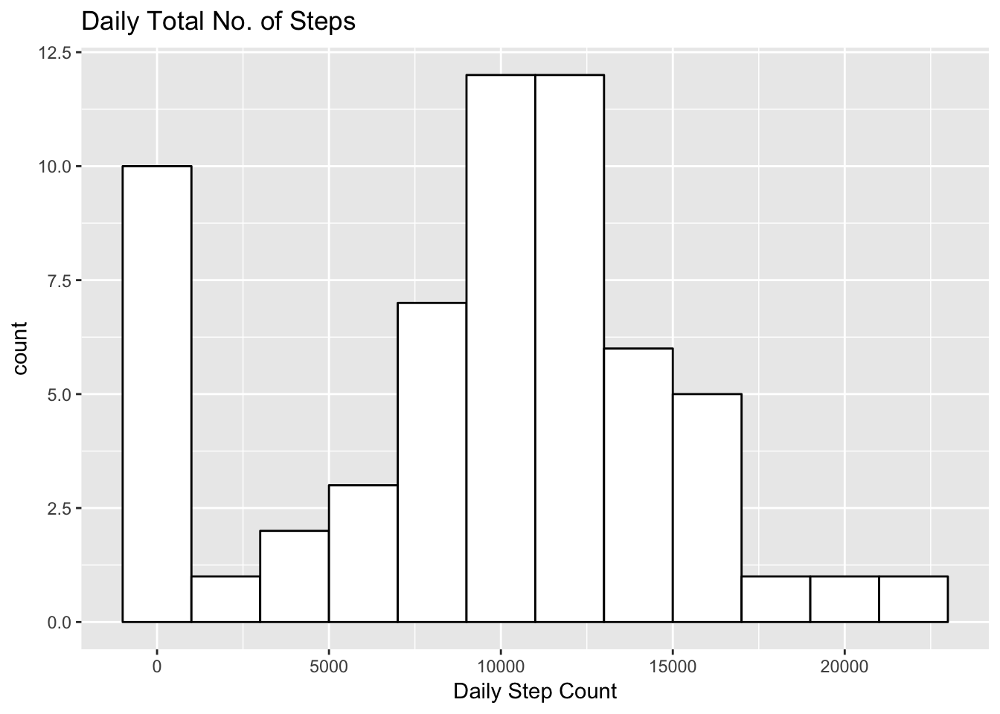
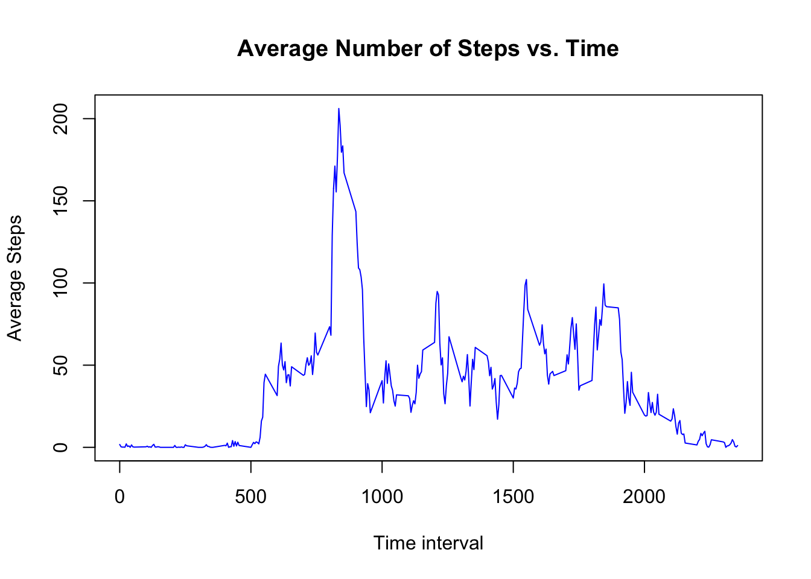
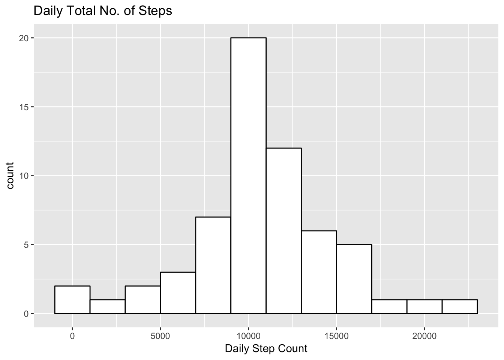
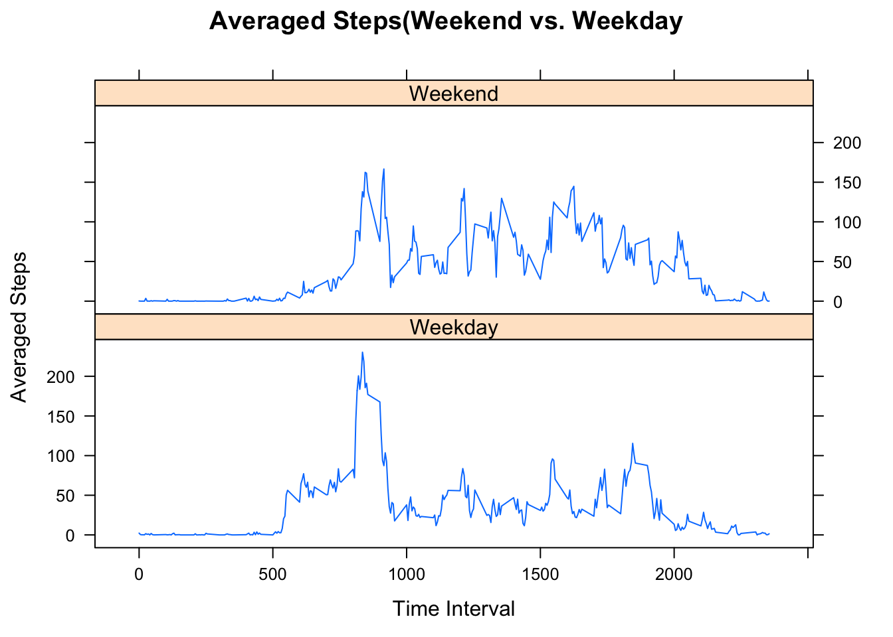

# Reproducible Research: Peer Assessment 1

Load the required library

```r
library(knitr, quiet=T)
library(plyr, quiet=T)  # For Mutate
library(ggplot2, quiet=T)  # For plotting
opts_chunk$set(dev="png", fig.path="figure/")
```

---
title: 'Reproducible Research: Course Project 1'
author: "acabaya"
date: "7/16/2017"
---
===============================================================================

## Introduction
It is now possible to collect a large amount of data about personal
movement using activity monitoring devices such as a [Fitbit](http://www.fitbit.com), [Nike Fuelband](http://www.nike.com/us/en_us/c/nikeplus-fuelband), or [Jawbone Up](https://jawbone.com/up). These type of devices are part of the "quantified self" movement -- a group of enthusiasts who take measurements about themselves regularly to improve their health, to find patterns in their behavior, or because they are tech geeks. But these data remain under-utilized both because the raw data are hard to obtain and there is a lack of statistical methods and software for processing and interpreting the data.

This assignment makes use of data from a personal activity monitoring device. This device collects data at 5 minute intervals through out the day. The data consists of two months of data from an anonymous individual collected during the months of October and November, 2012 and include the number of steps taken in 5 minute intervals each day.

This assignment makes use of data from a personal activity monitoring device. This device collects data at 5 minute intervals through out the day. The data consists of two months of data from an anonymous individual collected during the months of October and November, 2012 and include the number of steps taken in 5 minute intervals each day.

The data for this assignment can be downloaded from the course web site:

* Dataset: [Activity monitoring data](https://d396qusza40orc.cloudfront.net/repdata%2Fdata%2Factivity.zip) [52K]

The variables included in this dataset are:

* **steps**: Number of steps taking in a 5-minute interval (missing
    values are coded as `NA`)

* **date**: The date on which the measurement was taken in YYYY-MM-DD
    format

* **interval**: Identifier for the 5-minute interval in which
    measurement was taken


The dataset is stored in a comma-separated-value (CSV) file and there are a total of 17,568 observations in this dataset.

## Reading the dataset

Download the dataset by clicking the link above and unzip the file to the working directory of R.

The data set are loaded using read.csv

```r
activity <- read.csv("activity.csv", header=TRUE, 
                     colClasses = c("numeric", "character", "numeric"))
```

Showing the first few data rows of the data set:

```r
head(activity)
```

```
##   steps       date interval
## 1    NA 2012-10-01        0
## 2    NA 2012-10-01        5
## 3    NA 2012-10-01       10
## 4    NA 2012-10-01       15
## 5    NA 2012-10-01       20
## 6    NA 2012-10-01       25
```

## Histogram of the total number of steps taken each day

Before histogram can be made, the total steps made in a day has to be summurazed by day. In this case, we use the `tapply` function.

The histogram is created using ggplot2 library.

```r
daySteps <- tapply(activity$steps, activity$date, sum, na.rm=TRUE)

g<- ggplot(NULL, aes(x=daySteps)) + 
    geom_histogram(binwidth=2000, fill="white", col="black") + 
    ggtitle("Daily Total No. of Steps") + 
    xlab("Daily Step Count")

g
```

<!-- -->

Looking at the historgram created, there is a high frequency of days with 0 steps. These days are mainly caused not because the subject did not made a single step throughout the day but rather of missing values represented by * NA's *.

## Mean and median number of steps taken each day

The mean is calculated as follows.

```r
mean(daySteps, na.rm=TRUE)
```

```
## [1] 9354.23
```

The median is calculated as follows.

```r
median(daySteps, na.rm=TRUE)    
```

```
## [1] 10395
```

Both mean and median are biased given that there were 0's in the data set but are actually missing values.

## Time Series Plot of the average number of steps taken

The mean of steps made for a time interval of all days in the data set are calaculated using the `tapply` function and the time serries plot is created using the `plot` method.


```r
timeSteps <- tapply(activity$steps, activity$interval, mean, na.rm=TRUE)
plot(row.names(timeSteps), timeSteps, type="l", 
     xlab="Time interval", 
     ylab="Average Steps", 
     main="Average Number of Steps vs. Time", 
     col="blue")
```

<!-- -->

The time interval where the maximum  number of steps as in the maximum point shown in the plot is:


```r
names(which.max(timeSteps))
```

```
## [1] "835"
```

## Imputing Intervals with Missing Values on Steps

The number of intervals throughout the whole data set has missing values on steps is as follows:

```r
sum(is.na(activity$steps))
```

```
## [1] 2304
```

The strategy of filling in the missing values of steps, the mean of the number of steps for each interval as seen on the above time series plot will be used to impute the missing values.


```r
newAct <- activity
for(i in 1:nrow(newAct)) {
    if (is.na(newAct[i,]$steps)) {
        newAct[i,]$steps <- timeSteps[as.character(newAct[i,]$interval)]
    }
}
```

The histogram of total steps of each day with the imputed steps  will be done using the code as follows:

```r
newdaySteps <- tapply(newAct$steps, newAct$date, sum, na.rm=TRUE)
g<- ggplot(NULL, aes(x=newdaySteps)) + 
    geom_histogram(binwidth=2000, fill="white", col="black") + 
    ggtitle("Daily Total No. of Steps") + 
    xlab("Daily Step Count")

g
```

<!-- -->

Notice there are still is a few days with within 0 to 2000 steps but is now less frequent as the original historgram without the imputed values.


The new mean is calculated as follows

```r
mean(newdaySteps)
```

```
## [1] 10766.19
```

The new median as well is calculated as follows

```r
median(newdaySteps)
```

```
## [1] 10766.19
```

There is a significant difference in the values of the mean and median between the data sets with and without the imputed values. 

## Difference Between Activity Patern between Weekday and Weekend

In order to be able to compare weekend and weekday activity, another coolumn will be added to assign "Weekend" on dates that are either "Satruday" and "Sunday". The day of the week is determined using the function `weekdays`. All other day of the week that is neither "Satruday" nor "Sunday" is assigned as "Weekday"

```r
newAct <- mutate(newAct, weekend = weekdays(as.Date(newAct$date)))

for(i in 1:nrow(newAct)) {
    if (newAct[i,]$weekend == "Saturday") {
        newAct[i,]$weekend <- "Weekend"
    } else if (newAct[i,]$weekend == "Sunday") {
        newAct[i,]$weekend <- "Weekend"
    } else {
        newAct[i,]$weekend <- "Weekday"
    }
}
```

With the new data sets above, the plot comparing weekend and weekday patern of activities is coded as follows:


```r
library(lattice)
newSteps <- aggregate(steps ~ interval + weekend, data=newAct, mean)
xyplot(steps ~ interval | weekend,newSteps, type="l", layout = c(1,2),
       xlab="Time Interval", ylab="Averaged Steps",
       main="Averaged Steps(Weekend vs. Weekday")
```

<!-- -->


